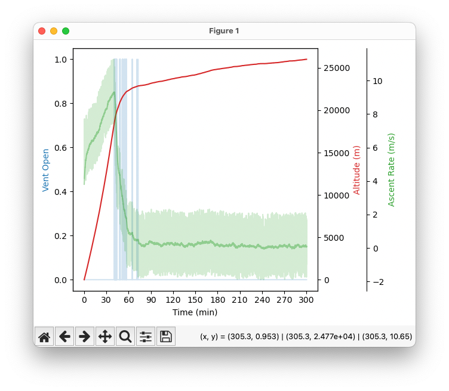

I got bored. I've been thinking about solutions to autonomous venting so I finally broke down and tried to simulate what I think might be a solution.

This folder contains a C file that runs the simulation, and a Python file that graps the results. You can run the whole thing with the simple one-liner below.

```
gcc sim.c -o sim.out && ./sim.out && python3 test.py
```

# The Control System

The control is actually very simple. It is two P controllers, an altitude outer loop and an ascent rate inner loop. The altitude loop accepts the desired altitude as the setpoint and provides a control single to the ascent rate loop. This loop then outputs a control signal that it used to open the vent. The control signal is gated as either a 1 or a 0 so that the loop is essentially always updating the status of the vent.

`ControlSystem_Init()` and `ControlSystem_Update()` are the key functions for the control system.

# The Simulation

The simulation iterates every second until it reaches `SIMULATION_TIME_MAX`. It accepts an initial ascent rate defined by `INITIAL_ASCENT_RATE` in units of m/s \* 1000. You'll notice that most of the units in the simulation are 1000 times greater than they should, this is to allow for the usage of integer only calculations because I'm a nut job.

The core of the simulation is `TestSystem_Update()` which accepts `inp` that controls venting and `t` which is time in seconds. Every iteration, if the control commands a vent then a random delta is applied to the `inner_ascent_rate` value to simulate the outgassing of helium. Additionally, every iteration a small amount of randomness is applied to `inner_ascent_rate` to create additional randomness. It is important to note that this additional randomness accumulates every iteration.

Final balloon velocity (`vel`) is produced by summing `inner_ascent_rate` with a randomly generated `noise` parameter. This parameter is a sinusoid of randomly changing amplitude and frequency which is designed to simulate the updrafts and downdrafts present during flight. I find that in real flight data, updrafts and downdrafts usually don't affect ascent rate for very long which is why a sinusoid is used here. However, the accumulating randomness mentioned above tends to create some larger ascent rate variations that help test system robustness in my opinion.

Final balloon position is then updated each iteration using the balloon velocity.

# Example

```
Altitude at 1 hour: 22337 m
Target altitude of 23000 m reached at 83 min
Altitude at 2 hours: 23716 m
Altitude at 3 hours: 24842 m
Altitude at 4 hours: 25496 m
Altitude at 5 hours: 26005 m
Total vent time: 188 s
```


